<!--
  Ahoy, source reader! Everything on this page is generated from profile.config.mjs
  by scripts/build.mjs. Edit the config, push, and the "Refresh profile" workflow
  rebuilds the cards (it also runs every day to keep the stats fresh).
-->

  

  

  

<!-- projects:start -->

  <a href="https://github.com/rexade/tidebound-harbor-godot"></a>
  <a href="https://github.com/rexade/ai-runtime-harness"></a>
  <a href="https://github.com/rexade/terminalorchestrator"></a>
  <a href="https://github.com/rexade/ai-skill-library"></a>
  <a href="https://github.com/rexade/Aseprite-color-Shader-Ink-Sync-"></a>
  <a href="https://github.com/rexade/mini-planet"></a>

<!-- projects:end -->

  

  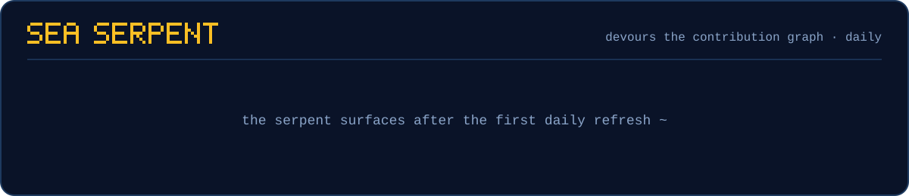

  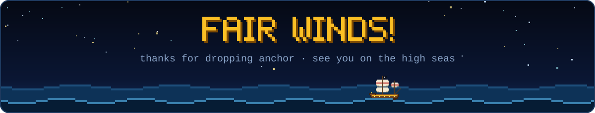

  

